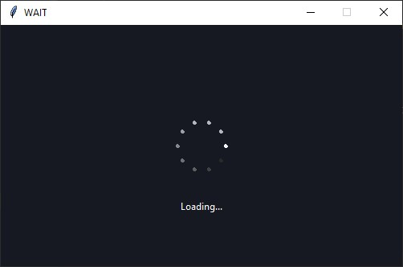

# TaskPopup

The widget TaskPopup handle blocking function in a GUI environment. The task is logically blocking but the execution of the main thread is not stopped.

An example of use:

```
import tkinter as tk
import time
from task_popup import TaskPopup


def blocking_function(duration):
    time.sleep(duration)
    return True


root = tk.Tk()

popup = TaskPopup(root, func=blocking_function, args=(2,), caption="Loading...")
popup.start()

root.wait_window(popup.top_level)

print("The function result is: ", popup.result)

root.mainloop()
```

This code generates that result:

